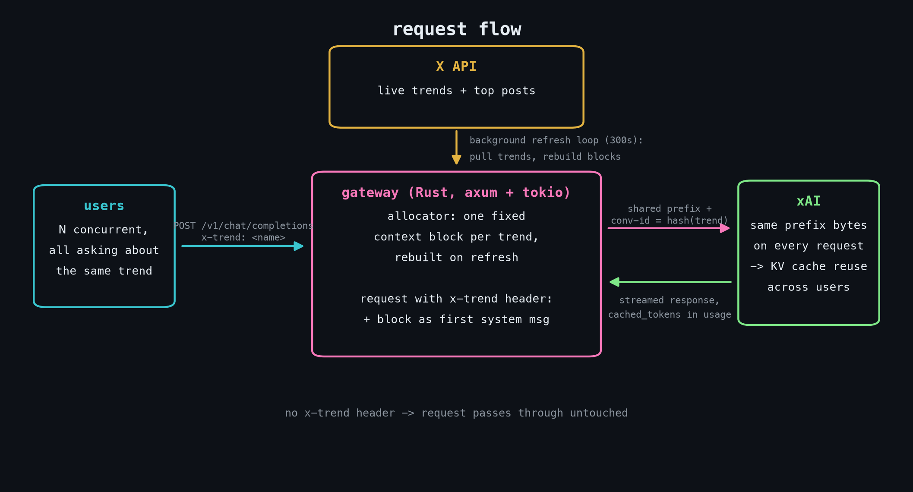
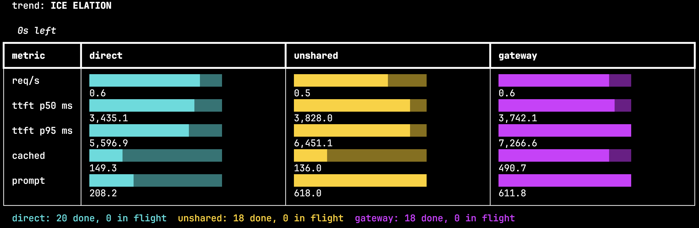
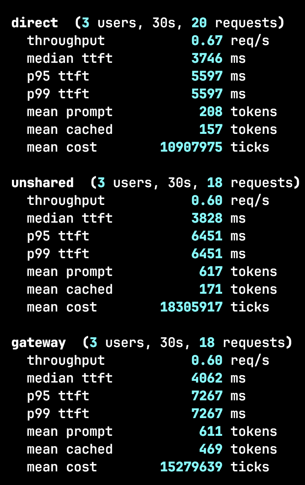

# prefix-x

## Hypothesis

If I take live X trending data, shape it into a fixed context block, and inject
it at the front of every request about that trend, the inference server's
prefix cache should hit across users instead of everyone paying full price for
the same context. So I built a gateway that does the injection, then I
benchmarked it. That is the whole project.

## What it does

- Rust gateway in front of api.x.ai.
- A background loop pulls current trends and top posts from the X API every
  300s and builds one fixed context block per trend.
- A request with `x-trend: <name>` gets that block injected as the first
  system message, byte-identical for every user asking about that trend.
- `x-grok-conv-id` gets pinned to a hash of the trend so same-topic requests
  route to the same server.
- No header, no injection. The request passes through untouched.



## Stack

The gateway does zero compute. It is pure I/O: every request is one upstream
call plus a JSON splice, and the box spends its life waiting on the network.
That drove the choices.

- **tokio**: async runtime built for exactly this. Thousands of concurrent
  in-flight requests on a handful of threads, which is what a proxy under
  load needs. The background refresh loop is just a `tokio::spawn` with a
  sleep, no extra thread or scheduler to manage.
- **axum**: thin routing layer on top of tokio/hyper. Shared state through
  extractors, handlers are plain async fns, no framework magic. I wanted a
  proxy, not a web framework.
- **reqwest** with streaming for the upstream call, so responses stream
  straight back to the caller without buffering the whole body.
- Benchmark in Python (openai SDK + rich live dashboard). Benchmarks are
  throwaway code, Python is faster to write.
- No local GPU. xAI hosts the model.

## Benchmark

Three arms, same questions about the same trend, N concurrent users each:

| arm | what it sends |
|---|---|
| direct | question only |
| unshared | same context block, but a unique first line per user (the control) |
| gateway | shared context block via the gateway |

The unshared arm is the control. Same prompt size, same work, but the unique
first line means nothing gets shared. Without it a nonzero `cached_tokens`
count proves nothing, since xAI reports a baseline even on direct requests.

```
cd benchmark && .venv/bin/python benchmark.py --users 20 --duration 60
```

It has a live dashboard while it runs.



## Findings



Sample run above: 3 users, 30s per arm.

- Cache hits happen. 469 of 611 prompt tokens came from cache through the
  gateway, vs 171 of 617 for the unshared control.
- Cost per request drops: 15.28M vs 18.31M ticks, about 17% cheaper than the
  control at this prefix size. The gap grows with prefix size, since the
  cache covers exactly those tokens.
- Direct is still cheapest, but it has no context at all, so it cannot
  actually answer questions about the trend.
- TTFT did not improve. Gateway median was slightly worse (4062ms vs 3828ms).
  The win is cost, not latency.
- The cache needs a warm-up request after each rebuild. The first one misses.

Single runs against a live service. Treat as signal, not proof.

## Layout

```
clients/    X and xAI API wrappers
gateway/    the proxy, prefix allocator, prefix builder
benchmark/  Python benchmark, runs the three arms against the gateway
```

## Running it

```
cd gateway && cargo run
```

Needs `X_BEARER_TOKEN` and `XAI_API_KEY` in `gateway/.env`.

| env var | default | what it does |
|---|---|---|
| `TREND_COUNT` | 5 | trends fetched and held |
| `POSTS_PER_TREND` | 8 | posts per block, controls prefix size |
| `REFRESH_INTERVAL_SECS` | 300 | background rebuild interval |

```
GET  /trends                    active trends
GET  /trends/{name}             that trend's context block
POST /v1/chat/completions       OpenAI-shaped chat body
  header x-trend: <name>        injects the block and pins the conv-id to
                                the topic. Omit it and the request passes
                                through untouched.
```

Smoke test: `cargo run --bin run-test -- "prompt" [trend name]`
